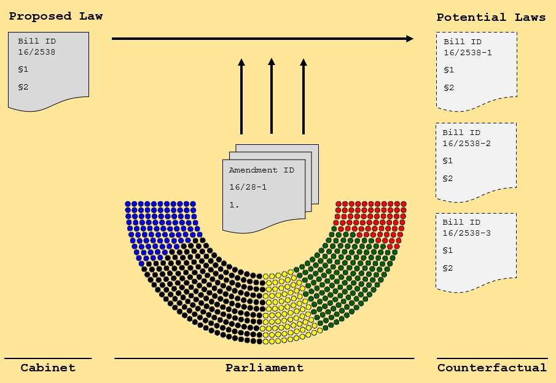

# The bill that never was: Re-covering counterfactual laws under opposition preferences
## :star: Purpose 
In the majority of parliamentary systems, the drafting of bills is the prerogative of the government. After a proposal for a new law has been drafted in ministries and
conciled with all coalition partners through cabinet deliberation, members of parliament discuss, scrutinize and *adapt* bill proposals by submitting *amendments* to 
government legislation. Since coalition parties hold the majority of the seat share in parliament, the opposition is usually left out as a bystander. While opposition 
parties regularly intensively re-work proposed legislation, their amendment proposals are almost always voted in parliament. As political observers, we almost never see 
how government laws would look like if opposition demands would be worked in because these **counterfactual bills don't come to light.** 

:question:*How would government bills look like if opposition demands would be incorporated in the legislative process*:question:

  

