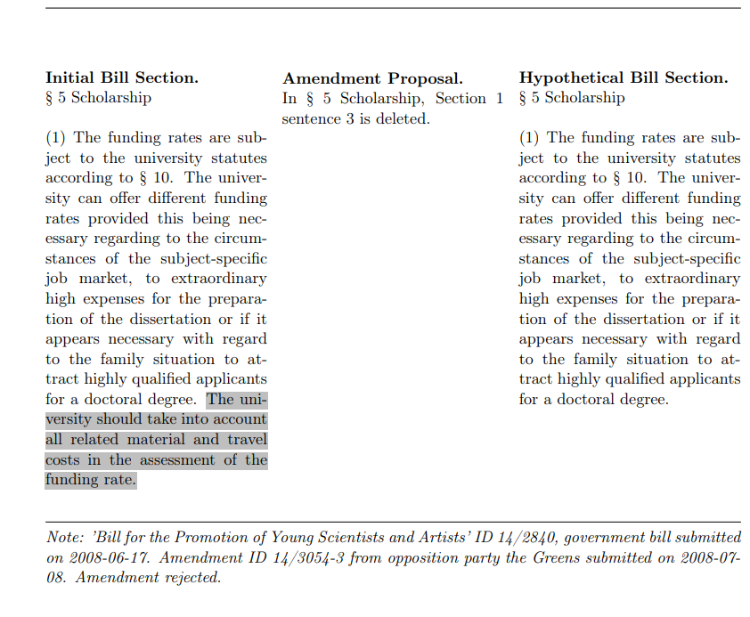

# The bill that never was: Recovering counterfactual laws under opposition preferences in the Bundestag
## :star: Purpose 

How would government bills look like if opposition demands would be incorporated in the legislative process?

Drafting of new bills is the prerogative of the government. After a proposal for a new law has been drafted, members of parliament discuss, scrutinize and adapt bill proposals by **submitting amendments to government legislation**. Since coalition parties hold the majority of the seats in parliament, the opposition is usually left out as a bystander. Opposition parties regularly intensively re-work proposed legislation, but their amendment proposals are usually voted down in parliament. 

As political observers, we almost **never see how government laws would look like if opposition demands would be incorporated** because these **counterfactual bills don't come to light.** 

**Goal:** Amendment proposals to government bills essentially are intended string manipulations. In this project, we recover these counterfactual bills by automatically implementing all intended string manipulations programming a **natural language processing pipeline in R**. 

  

## 🛠 How did we do it?
### Step 1: Downloading data 
We webscraped the official Bundestag database (*Dokumentations- und Informationssystem DIP*) and aquired all bill proposals and amendment proposals from 2013-2020. Some amenndment proposals are published as standalone documents (*Drucksachen*). Others are part of published committee reports. 

### Step 2: Getting data into shape
We read in all PDF content into R, and using the R package **stringr** and **regular expressions**, we automatically *extract* and *structure* all 
- legislative text
- structural information (legislative period, authorship, etc.)

### Step 3: Constructing action matrices
We translate the content of each amendment proposal into a machine-readable **action matrix**. Each action matrix contains all relevant string manipulations needed to transform the empirically observed government bill into the intended counterfactual bill under opposition preferences. Each amendment proposal is translated into one action matrix. 

### Step 4: Executing action matrices
We loop over all amendment proposals and all individual string manipulations that are layed out in one amendment proposal and automatically implement these into the baseline bill as proposed by the government. All text edits can be categorized into on of three operations
- text addition 
- text deletion 
- text replacement 
We define the three action functions `hinzufuegen()`, `loeschen()` and `neufassen()` which are activated at respective places in the action matrix. 

## :mag: Result: Examples of Counterfactual Bills 
Counterfactual bills are defined as government legislation as it would look like if opposition amendment proposals would have been taken into account. Some exemplary counterfactual bill sections are: 

  
   

